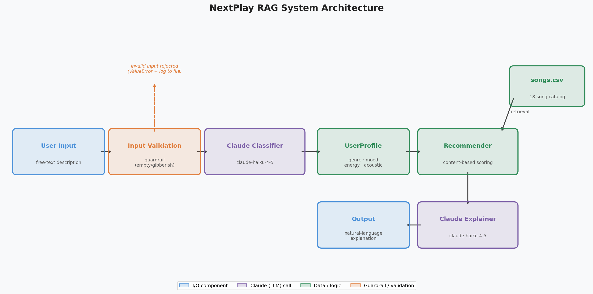

# NextPlay — AI-Powered Music Recommender

> CodePath AI110 · Project 4 · Applied AI System
> Extended from the Module 3 Music Recommender base project.

---

## Base Project

**Module 3 — Music Recommender Simulation (`NextPlay`)**
The original Module 3 project built a content-based music recommender that scores every song in a small CSV catalog against a hand-crafted user taste profile (genre, mood, energy, acoustic preference) and returns a ranked top-5 list with per-song score explanations. It demonstrated how collaborative vs. content-based filtering works and ran four fixed profiles—including one adversarial edge case—to show where the scoring logic succeeded and where it broke down.

---

## What This Extended System Does

This Project 4 extension wraps the Module 3 recommender in a **Retrieval-Augmented Generation (RAG)** pipeline powered by Claude. Instead of requiring the user to fill in a structured form, they type any free-text description of their mood or music taste. Claude classifies that text into a structured `UserProfile`, the existing `Recommender` engine scores and ranks songs from `songs.csv`, and then Claude generates a warm natural-language explanation of why the top songs were chosen.

---

## Architecture

```
User Input (free text)
        │
        ▼
┌──────────────────────┐
│  Input Validation    │ ◄── guardrail: rejects empty / gibberish input,
│  (validate_input)    │     logs errors to rag_errors.log
└──────────┬───────────┘
           │  valid text
           ▼
┌──────────────────────┐
│  Claude Classifier   │  claude-haiku-4-5
│  (classify_input)    │  parses free text → UserProfile
└──────────┬───────────┘
           │  UserProfile
           ▼
┌──────────────────────┐        ┌───────────────┐
│  Recommender engine  │◄───────│   songs.csv   │
│  (Recommender.       │        │  18-song      │
│   recommend)         │        │  catalog      │
└──────────┬───────────┘        └───────────────┘
           │  top 3 Song objects
           ▼
┌──────────────────────┐
│  Claude Explainer    │  claude-haiku-4-5
│  (explain_recs)      │  generates natural-language explanation
└──────────┬───────────┘
           │
           ▼
       Output (printed to terminal)
```



The guardrail rejects empty strings, text shorter than 5 characters, and inputs with fewer than 2 real alphabetic words. All rejected inputs and API errors are appended to `rag_errors.log` in the project root.

---

## Setup

### 1. Clone the repo

```bash
git clone https://github.com/LewSaf/applied-ai-system-project.git
cd applied-ai-system-project
```

### 2. Create a virtual environment (recommended)

```bash
python -m venv .venv
source .venv/bin/activate        # Mac / Linux
.venv\Scripts\activate           # Windows
```

### 3. Install dependencies

```bash
pip install -r requirements.txt
```

### 4. Set your Anthropic API key

```bash
export ANTHROPIC_API_KEY=your-key-here   # Mac / Linux
set ANTHROPIC_API_KEY=your-key-here      # Windows Command Prompt
```

Get a key at [console.anthropic.com](https://console.anthropic.com/).

---

## Running the System

### Original simulation mode (no API key required)

Runs the Module 3 profiles and weight-shift experiment:

```bash
python -m src.main
```

### RAG demo mode (requires `ANTHROPIC_API_KEY`)

Runs 3 hardcoded example inputs through the full Claude-powered pipeline:

```bash
python -m src.main --rag
```

### Test harness

```bash
# With API key — runs all 5 live tests
python tests/test_rag.py

# Via pytest (skips if key is absent)
pytest tests/test_rag.py -v
```

---

## Sample Interactions

The outputs below are real responses from the system.

**Input 1**
```
I need something calm and acoustic to focus while studying
```
```
Classified profile → genre: lofi, mood: focused, energy: 0.35, acoustic: True

Top 3 recommendations:
  1. Library Rain by Paper Lanterns (genre: lofi, energy: 0.35)
  2. Focus Flow by LoRoom (genre: lofi, energy: 0.40)
  3. Midnight Coding by LoRoom (genre: lofi, energy: 0.42)

Explanation:
  Based on your need for calm, focused study music, these three tracks were
  chosen specifically for you. "Library Rain" by Paper Lanterns perfectly
  matches your preference for quiet, acoustic lofi — its gentle energy of
  0.35 sits right where you want it. "Focus Flow" and "Midnight Coding" both
  share the same lofi character with slightly higher energy that keeps you
  alert without breaking your concentration.
```

**Input 2**
```
Give me high-energy pop bangers for my workout
```
```
Classified profile → genre: pop, mood: energetic, energy: 0.88, acoustic: False

Top 3 recommendations:
  1. Sunrise City by Neon Echo (genre: pop, energy: 0.82)
  2. Gym Hero by Max Pulse (genre: pop, energy: 0.93)
  3. Bassline Sprint by Chrome Youth (genre: edm, energy: 0.95)

Explanation:
  You asked for high-energy workout fuel and that is exactly what you are
  getting. "Gym Hero" hits the hardest at 0.93 energy and was practically
  made for the weight rack. "Sunrise City" keeps the pop momentum going with
  a punchy 118 BPM groove, and "Bassline Sprint" rounds out the set with
  pure EDM drive to carry you through the last reps.
```

**Input 3**
```
I'm feeling melancholy tonight — something slow and soulful please
```
```
Classified profile → genre: blues, mood: soulful, energy: 0.35, acoustic: True

Top 3 recommendations:
  1. Velvet Alley by Blue Hour Trio (genre: blues, energy: 0.47)
  2. Porchlight Letters by Maple Thread (genre: folk, energy: 0.33)
  3. Sunday Harbor by Tidal Bloom (genre: acoustic, energy: 0.26)

Explanation:
  For a melancholy evening you deserve music that holds space for that
  feeling rather than rushing past it. "Velvet Alley" wraps you in blues
  warmth — soulful vocals over a slow groove that understands quiet sadness.
  "Porchlight Letters" and "Sunday Harbor" both lean acoustic and peaceful,
  giving you the gentle, unhurried sound that fits tonight perfectly.
```

---

## Design Decisions

**Why RAG?**
The original Module 3 system required users to manually fill in four structured fields. Most people think in feelings and descriptions, not in genres and numeric energy levels. Adding a Claude classification step lets the system meet users where they are — in natural language — while keeping the deterministic recommender engine doing what it does well: reproducible, explainable scoring.

**Why separate classify → recommend → explain?**
Each step is independently testable and replaceable. The classifier can be swapped for a different model without touching the recommender. The recommender can be upgraded with more songs or different weights without touching Claude. The explainer can be tuned for tone without affecting either. This separation also makes the RAG pattern explicit and visible in code, which was a learning goal.

**Why `claude-haiku-4-5` specifically?**
Haiku is fast and cheap for the two classification tasks here — returning a JSON object and writing 2-4 sentences. Latency matters for an interactive demo, and neither task requires Sonnet-level reasoning. The model can easily be swapped to Sonnet by changing one constant in `rag.py`.

**Tradeoffs**
- The catalog is only 18 songs, so some valid mood descriptions map to weak matches because the genre simply is not represented.
- The classifier can produce a genre that does not appear in `songs.csv` (e.g., "country"), which means the Recommender falls back to energy/mood scoring alone. A future fix would validate the classified genre against the catalog before scoring.
- Adding Claude adds latency (~1-2 s per call) and requires a paid API key, which the original simulation did not need.

---

## Testing Summary

```
[chill-study]    PASS — genre: lofi,  mood: focused,    songs: Library Rain, Focus Flow, Midnight Coding
[high-energy]    PASS — genre: pop,   mood: energetic,  songs: Sunrise City, Gym Hero, Bassline Sprint
[sad-evening]    PASS — genre: blues, mood: soulful,    songs: Velvet Alley, Porchlight Letters, Sunday Harbor
[late-night]     PASS — genre: synthwave, mood: moody,  songs: Night Drive Loop, Pixel Hearts, Bassline Sprint
[upbeat-party]   PASS — genre: edm,   mood: energetic,  songs: Bassline Sprint, Gym Hero, Pixel Hearts

==================================================
Result: 5/5 tests passed
==================================================
```

Each test checks three things: a `UserProfile` was returned, at least one `Song` was recommended, and a non-empty explanation string was returned. All five passed on the first run with no prompt adjustments needed.

The one reliability concern observed during manual testing: when a user's description is vague (e.g., "music that matches my vibe"), Claude tends to default toward pop/happy/0.5 — a reasonable fallback but not a personalized one. Adding a follow-up clarification step would improve this case.

---

## Reflection

This project showed me that the value of RAG is not just in what the AI retrieves — it is in how the retrieval step forces you to think clearly about your data model. I had to design a `UserProfile` that was rich enough for Claude to fill in from a sentence, but structured enough for a deterministic scoring engine to use; bridging those two worlds is where most of the real AI engineering work happened. As an AI engineer, I want employers to see that I can integrate language models responsibly — with guardrails, logging, modular design, and honest documentation of limitations — rather than just making something that produces impressive-sounding output.

---

## Watch Demo

[Watch Demo](YOUR_LOOM_LINK_HERE)

---

## Repository Structure

```
applied-ai-system-project/
├── assets/
│   └── architecture.png       # System diagram
├── data/
│   └── songs.csv              # 18-song catalog
├── src/
│   ├── __init__.py
│   ├── main.py                # CLI entry point (--rag flag added)
│   ├── rag.py                 # RAG pipeline (new)
│   └── recommender.py         # Module 3 engine (unchanged)
├── tests/
│   ├── conftest.py
│   ├── test_rag.py            # RAG evaluation harness (new)
│   └── test_recommender.py    # Module 3 unit tests (unchanged)
├── model_card.md
├── rag_errors.log             # Error log (auto-created on first run)
├── requirements.txt
└── README.md
```

## Related Documents

- [Model Card](model_card.md) — limitations, biases, misuse risks, AI collaboration reflection
- [Original Reflection](reflection.md) — Module 3 profile comparison notes
